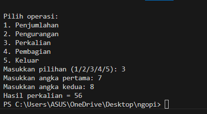
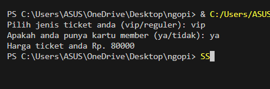

# Program Kalkulator Sederhana
Program ini adalah kalkulator sederhana yang bisa melakukan operasi dasar seperti penjumlahan, pengurangan, perkalian, dan pembagian.
---

## Rincian Program :
#### 1. Fungsi Aritmatika
- Penjumlahan: Menambahkan dua angka.
- Pengurangan: Mengurangi angka kedua dari angka pertama.
- Perkalian: Mengalikan dua angka.
- Pembagian: Membagi angka pertama dengan angka kedua, dengan pengecekan agar tidak membagi dengan nol.

#### 2. Fungsi Utama kalkulator():
- Menampilkan menu pilihan operasi.
- Mengambil pilihan dari pengguna dan memvalidasi input.
- Meminta pengguna memasukkan dua angka dan memastikan input valid.
- Melakukan operasi sesuai pilihan dan menampilkan hasilnya.

#### 3. Menjalankan Program:
Program dimulai dengan memanggil fungsi kalkulator(), yang menjalankan semua langkah di atas.

#### *Fitur Tambahan
Program ini dapat menangani kesalahan input, seperti angka yang tidak valid atau pembagian dengan nol, sehingga memberikan informasi yang tepat kepada pengguna.

---
# Flowchart
````mermaid
flowchart TD
    A(Mulai) --> B[Tampilkan Menu]
    B --> C{Pilih Operasi}
    
    C -->|5 Keluar| D[Anda keluar dari kalkulator]
    C -->|>5 atau <=0 atau Kosong| E[Pilihan tidak valid! Keluar]
    C -->|1-4| F[Masukkan Angka Pertama]
    F --> G[Masukkan Angka Kedua]
    
    G --> H{Validasi Angka}
    H -->|Tidak Valid| I[Tidak Memasukkan Angka, Keluar]
    H -->|Valid| J{Pilihan Operasi}
    
    J -->|1 Penjumlahan| K[Hasil = Penjumlahan angka1, angka2]
    J -->|2 Pengurangan| L[Hasil = Pengurangan angka1, angka2]
    J -->|3 Perkalian| M[Hasil = Perkalian angka1, angka2]
    J -->|4 Pembagian| N{Apakah Angka Kedua = 0}
    
    N -->|Ya| O[Pembagian tidak bisa menggunakan 0]
    N -->|Tidak| P[Hasil = Pembagian angka1, angka2]
    
    K --> Q[Tampilkan Hasil]
    L --> Q
    M --> Q
    O --> Q
````
---
## Kode Program 
```python
# Mendefinisikan operasi aritmatika
def penjumlahan(a, b):
    return a + b

def pengurangan(a, b):
    return a - b

def perkalian(a, b):
    return a * b

def pembagian(a, b):
    if b != 0:
        return a / b
    else:
        return "Pembagian tidak bisa menggunakan 0"

# Fungsi utama untuk menjalankan kalkulator
def kalkulator():
    print("--------------------------")
    print("--- Kalkulator Sederhana ---")
    print("--------------------------")
    
    print("Pilih operasi:")
    print("1. Penjumlahan")
    print("2. Pengurangan")
    print("3. Perkalian")
    print("4. Pembagian")
    print("5. Keluar")
    
    # Memilih jenis operasi
    pilihan = input("Masukkan pilihan (1/2/3/4/5): ")
    
    # Cek pilihan untuk keluar atau pilihan yang tidak valid
    if pilihan == '5':
        print("Anda keluar dari kalkulator.")
        return
    elif pilihan > '5' or pilihan <= '0' or pilihan == '':
        print("Pilihan yang dipilih tidak valid!")
        return
    
    # Memasukkan angka dan validasi input
    try:
        angka1 = int(input("Masukkan angka pertama: "))
        angka2 = int(input("Masukkan angka kedua: "))
    except ValueError:
        print("Anda tidak memasukkan angka yang valid!")
        return
    
    # Proses dan hasil berdasarkan pilihan operasi
    if pilihan == '1':
        hasil = penjumlahan(angka1, angka2)
        print("Hasil penjumlahan =", hasil)
    elif pilihan == '2':
        hasil = pengurangan(angka1, angka2)
        print("Hasil pengurangan =", hasil)
    elif pilihan == '3':
        hasil = perkalian(angka1, angka2)
        print("Hasil perkalian =", hasil)
    elif pilihan == '4':
        hasil = pembagian(angka1, angka2)
        print("Hasil pembagian =", hasil)

# Menjalankan program kalkulator
kalkulator()
```

## Hasil Output Program



---

## Cara Kerja Program

1. Input Pilihan:
    - Pengguna diminta untuk memilih jenis operasi dengan memasukkan nomor.
2. Cek Pilihan:
    - Program mengecek apakah pilihan valid (1-5) dan tidak kosong.
3. Input Angka:
    - Jika pilihan oke, pengguna diminta untuk memasukkan dua angka.
4. Lakukan Operasi:
    - Program menghitung hasil sesuai pilihan yang dipilih.
5. Tampilkan Hasil:
    - Hasil perhitungan ditampilkan ke pengguna.
6. Tangani Kesalahan:
    - Jika ada kesalahan, seperti membagi dengan nol, program kasih tahu pengguna.
7. Ulang atau Keluar:
    - Pengguna bisa memilih operasi lain atau keluar dari program.

---

 # Sistem Pembelian Tiket
Program sederhana untuk menghitung harga tiket Bioskop dan menerapkan diskon berdasarkan status member.

## Deskripsi Program
Program ini memungkinkan pengguna untuk:

- Memilih jenis tiket (VIP/Reguler)
- Menentukan status member
- Mendapatkan perhitungan harga tiket final dengan diskon (jika memiliki kartu member)

## Flowchart Ticket
````mermaid
flowchart TD
    A([Start]) --> B[Set Harga VIP = 100000]
    B --> C[Set Harga Reguler = 50000]
    C --> D[/Input Jenis Tiket/]
    
    D --> E{Jenis Tiket Valid?}
    E -->|VIP| F[Tetapkan Harga = 100000]
    E -->|Reguler| G[Tetapkan Harga = 50000]
    E -->|Tidak Valid| H[/Tampilkan Pesan Error/]
    
    F --> I[/Input Status Member/]
    G --> I
    H --> J([Exit])
    
    I --> K{Member?}
    K -->|Ya| N[harga_ticket -= harga_ticket * 0.20]
    K -->|Tidak| O[/Tampilkan Harga Akhir/]
    
    
    N --> O[/Tampilkan Harga Akhir/]
    O --> P([End])

````

## Contoh Output Program



---

## Cara Kerja Program:

1. Program menentukan harga awal:
   - Tiket VIP: Rp 100.000
   - Tiket Reguler: Rp 50.000

2. User diminta memilih jenis tiket:
   - Jika memilih "vip", harga diset Rp 100.000
   - Jika memilih "reguler", harga diset Rp 50.000
   - Jika input selain keduanya, program berhenti dengan pesan "Input tidak valid"

3. User diminta konfirmasi kepemilikan kartu member:
   - Jika memiliki kartu member (input "ya"), akan mendapat diskon 20%
   - Jika tidak memiliki (input "tidak"), tidak ada diskon

4. Program menampilkan harga akhir setelah perhitungan diskon

Contoh perhitungan:
- Jika pilih VIP dan punya member:
  Rp 100.000 - (20% × Rp 100.000) = Rp 80.000
- Jika pilih Reguler dan punya member:
  Rp 50.000 - (20% × Rp 50.000) = Rp 40.000

---
